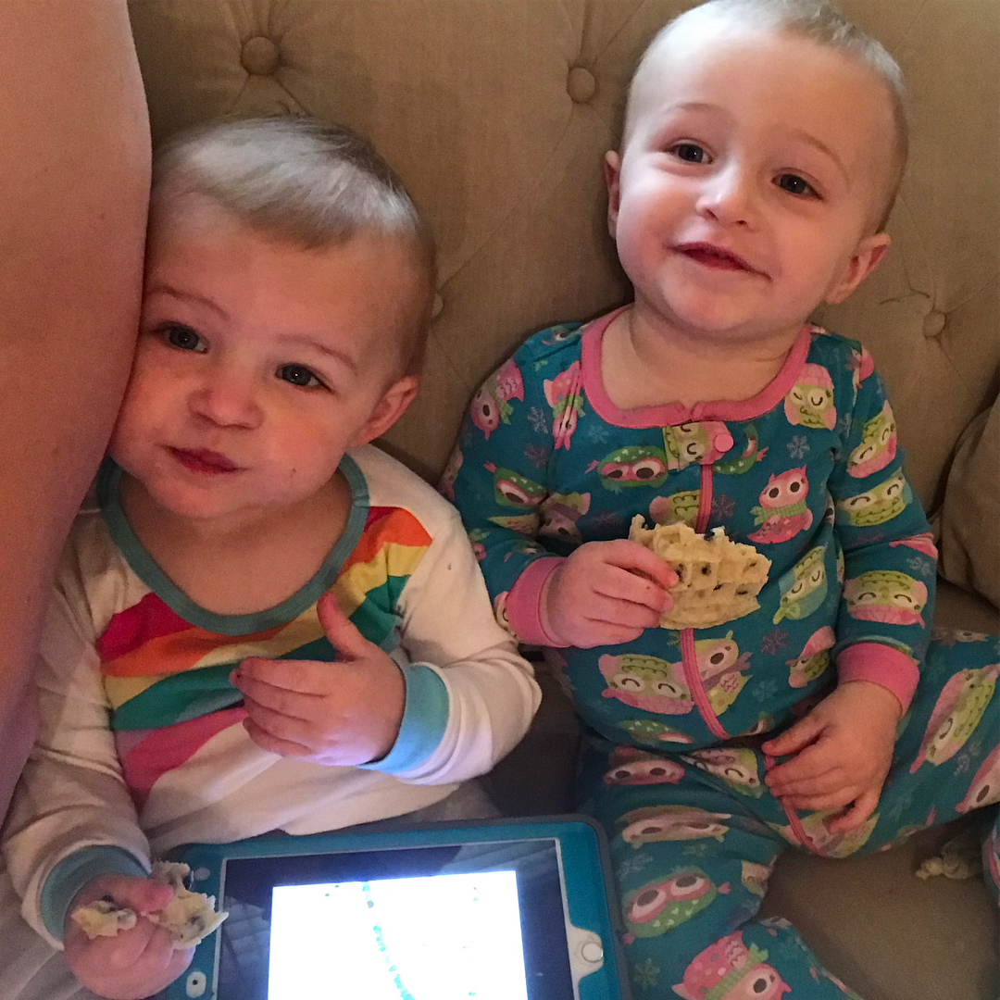

```css 
config:theme 

.default-slide {
    background-color: rgb(1,22,39);
}

.default-text {
    color: rgb(106, 215, 152);
    font-family: Futura;
    font-weight: bold; 
    font-size: 22px; /* for paragraph? leave this out? */
}

.h1 {
    font-size: 46px
}
.h2 {

    font-size: 32px
}
.h3 {
    font-size: 22px
}

.li {
    font-size: 22px
}
```

# Speaking to baby turtles
The best



---
## Love it much yes really
It is so the best ever

- First bullet
- second bullet
- Third bullet

```notes
This is the best thing that's ever happened to me
```


---
# Slide with no image?

What is this magic?

---
### Third slide is NOOO the best
Secondary title on main slide

```js
console.log('the best thing evar!');
alert('no way jose'
```

Even better?


